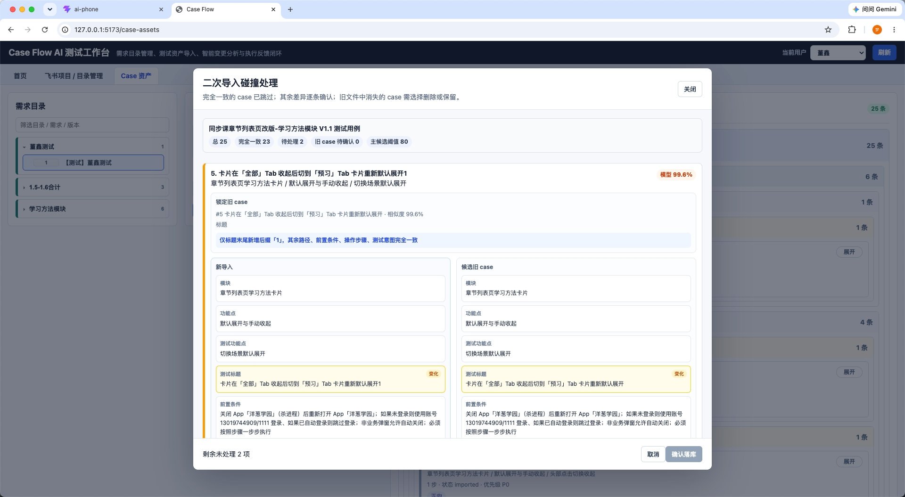
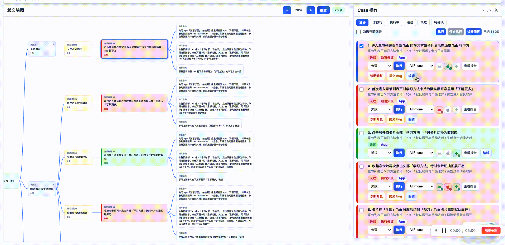
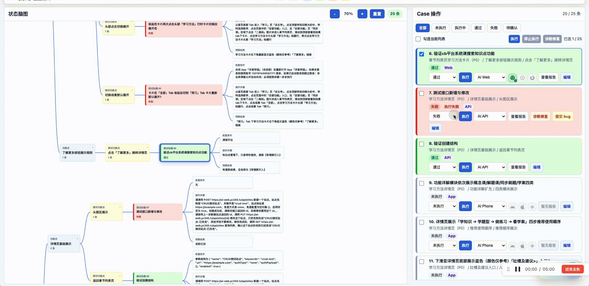
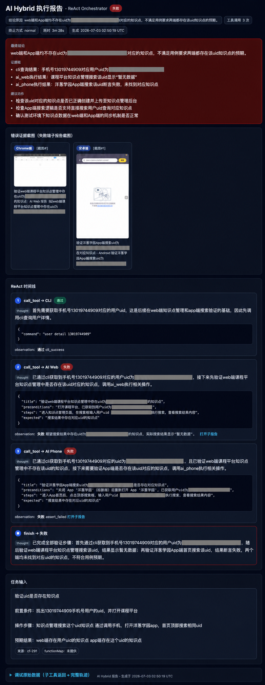
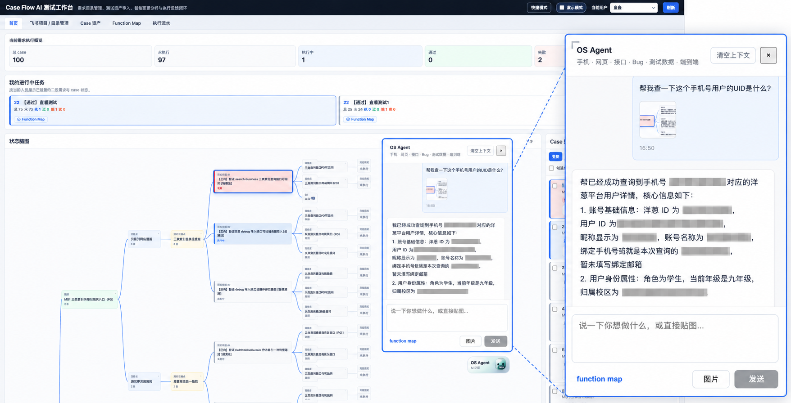
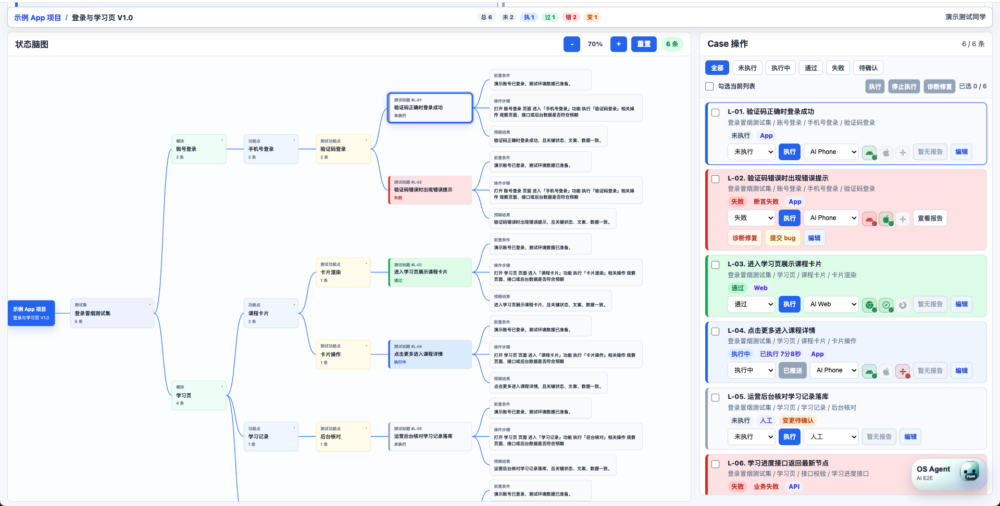
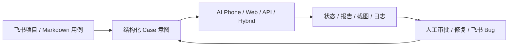
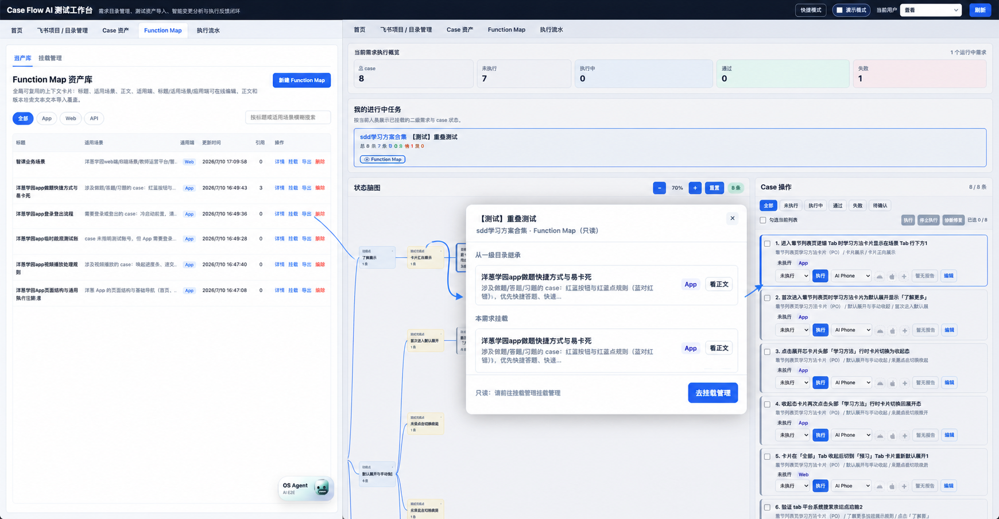
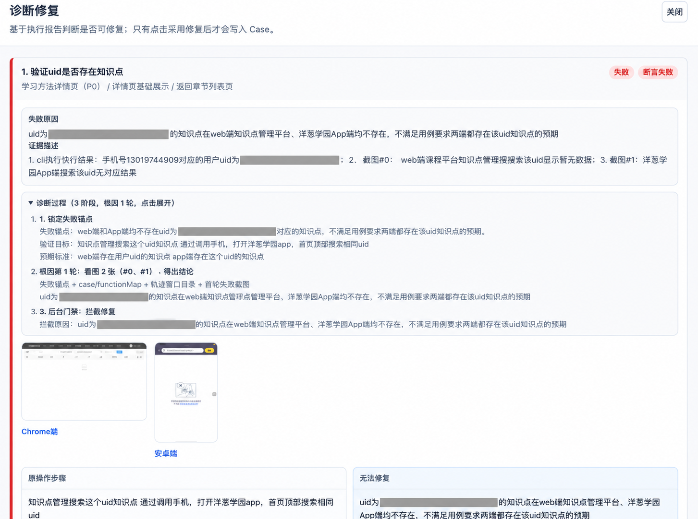
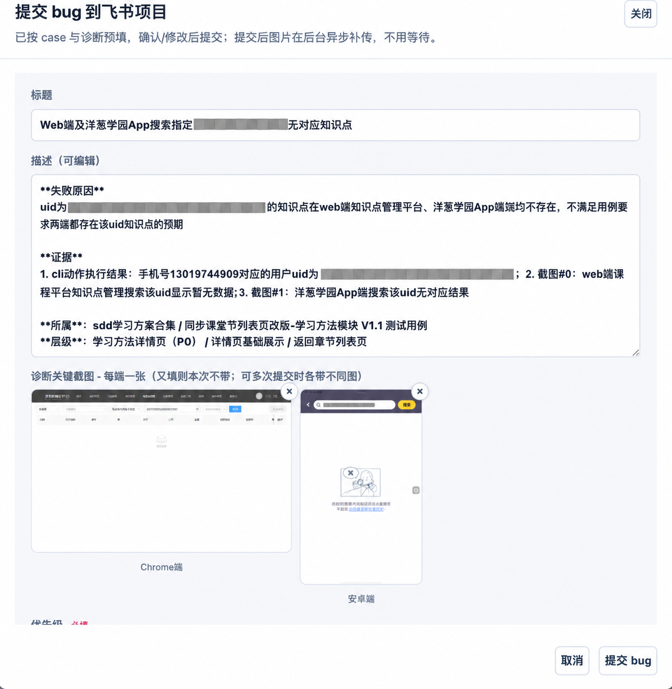

# Case Flow

> 面向企业二次开发的 AI 测试工作台核心。

把 Markdown 测试意图变成可视化 Case，分发给 AI 执行器，再把状态、报告、证据、修复建议和 Bug 草稿带回同一个工作台。

拖入一份 Markdown，Case Flow 会完成结构解析并进入可视化工作台。没有飞书，也可以先从这里开始整理和打磨 Case。

## 为什么是 Case Flow

Case Flow 不是单纯的用例管理或 AI 执行面板。它围绕需求生命周期维护测试意图：需求变更，Case 跟着更新；Case 更新，必须重新执行，并留下报告、截图、日志或人工确认等证据；确认通过后，才归档为可复用测试资产。

Case 不需要先被转写成另一套脱离业务意图的自动化脚本，才能进入执行。它以测试意图直接驱动 AI Phone、AI Web、AI API、AI Hybrid 等执行器；执行器围绕同一份 Case 协同，执行结果和证据再回到这份 Case。

最终形成的测试库，不只是“写过的 Case”，而是一套与当前产品版本持续对齐、能够真实执行并证明结果的测试真相。就像代码仓库的 master 是代码事实源，Case Flow 要成为测试侧的事实源。

## 一套 Case 工作台，连接四类执行器

Case Flow 公开维护四类执行能力：**AI Phone、AI Web、AI API、AI Hybrid**。

### AI Phone · 一条 Case 跑三端

同一条 App Case 可选择 iOS、Android、HarmonyOS 设备并行执行，状态和报告统一回到工作台。

### AI Web · 多浏览器并行执行

Web Case 可分发到多个 Chrome、Firefox、Safari 浏览器槽位并行执行。

### AI API · 自然语言接口执行

将自然语言 API Case 编译为受控 HTTP 请求，回收响应、断言和报告。

### AI Hybrid · 跨端编排

AI Hybrid 用于需要跨端协作的 Case：它会记录每一步调用、观察到的证据和最终结论，便于复盘，而不是把复杂执行变成黑盒。

## OS Agent：一句话调度已有能力

OS Agent 是工作台里的聊天式工具入口：可以按任务需要调用手机、网页、接口、报告和缺陷等能力。CLI 只是其中一个可选 Tool；没有接入 CLI 时，其他已配置能力仍可独立使用。

## 工作台全景

上图就是产品主界面：左侧用脑图查看 Case 结构和执行状态，右侧完成单条或批量执行、停止、报告查看、诊断修复和 Bug 提交。当前公开维护 AI Phone、AI Web、AI API 与 AI Hybrid。

## 从测试意图到证据闭环

Case Flow 不替代执行器。执行器负责跑，工作台负责组织测试意图、展示过程和证据；AI 可以执行和提出建议，最终是否修复、提交 Bug 或沉淀为测试资产仍由人确认。

## 让执行器真正理解业务

Function Map 是可复用的业务执行上下文：把页面规则、接口约定、登录方式和测试注意事项从单条 Case 中抽离出来，作为卡片挂到需求和执行上下文上。

卡片可被多个需求复用；执行时只把当前需求显式挂载、且适用于当前端的上下文交给执行器。它不是自动猜测的全局知识库，也不是使用教程的一部分，而是让 Case 在业务变化中仍然可执行、可追溯的上下文层。详见 [Function Map](docs/Function-Map.md)。

## 失败以后，不只留下一份报告

| 诊断失败证据与修复可能性 | 确认后提交飞书 Bug |
|---|---|
|  |  |

失败后，报告、截图和日志会自动回流到原 Case。系统基于这些证据自动诊断，识别可能的修复路径并生成可编辑的修复建议；确认无法修复或需要跟进时，可一键生成飞书 Bug。确认提交后，失败截图会随缺陷自动异步上传到飞书，无需等待。系统不会用假成功或静默跳过掩盖缺失能力。

## 两种产品形态

### 快速模式：独立的 Case 打磨基地

不接入飞书，也可以直接导入 Markdown 用例，在工作台里查看结构、调整内容、整理 Case，再重新导出。

导入时会先用关键字规则识别 App、Web、API 等执行端；没有配置模型时，规则无法识别的 Case 会归为人工，但不会因此阻断整批导入。模型只负责增强识别、诊断和 Hybrid 编排，不是 Case 打磨的使用门槛。

### 标准模式：围绕飞书需求沉淀测试资产

从飞书项目获取需求池，把需求组织成一级目录和二级需求，再导入、打磨并维护对应的 Case 资产。Case 执行完成后，状态、报告、失败证据、修复建议和飞书 Bug 会回到同一条业务链路。

飞书是当前唯一官方维护的需求与缺陷平台。其他企业可以保留这套公共流程，再自行接入 Jira、钉钉、禅道或内部平台。

## 核心能力

| Case 资产 | AI 执行 | 证据与审批 |
|---|---|---|
| Markdown 结构化导入 | 单条或批量分发 | 状态脑图实时呈现 |
| 可配置的用例层级 | AI Phone / Web / API | 报告、截图与日志回收 |
| 重复导入碰撞审批 | AI Hybrid 自主编排 | 诊断修复与人工确认 |
| 可视化编辑与导出 | 多端执行状态统一展示 | 生成飞书 Bug 草稿 |

Markdown 层级不是写死的。不同团队可以调整目录深度和层级名称，快速模式也会根据导入文件动态保留路径结构。

## 开源边界

Case Flow 提供的是可继续开发的开源产品，不包含任何公司的账号、令牌、私有基础设施和内部 CLI。

- 需求与缺陷平台：官方只维护飞书，其他平台由使用方自行开发。
- 模型：官方以豆包/Ark 为维护基线，其他模型由使用方自行适配和验证。
- 执行器：AI Phone、AI Web、AI API 和 AI Hybrid 属于公开能力。
- CLI：只是可选 Tool，不是产品前提；开源版本不内置公司 CLI，也不要求其他企业必须拥有 CLI。
- 缺失能力：真正调用时会明确说明需要配置或二次开发，不返回假成功。

## 进一步了解

- 想完整了解产品行为：[功能说明](docs/功能说明.md)
- 不接飞书如何使用：[快速模式](docs/快速模式.md)
- 如何自定义 Markdown 层级：[Markdown 导入与层级配置](docs/Markdown层级配置.md)
- 如何接入飞书与执行器：[飞书项目接入](docs/飞书项目接入.md) · [AI Phone](docs/AI-Phone集成.md) · [AI Web](docs/AI-Web集成.md) · [AI API](docs/AI-API集成.md)
- 部署、配置与开发：[开发与运维](docs/开发与运维.md)
- 浏览所有公开文档：[文档索引](docs/索引.md)

## 执行器

- [AI Phone](https://github.com/dongxinsuperman/ai-phone)：独立开源的移动端执行器；按其仓库文档单独部署后，在 Case Flow 中配置连接地址。
- **AI API / AI Hybrid**：Case Flow 内置能力，无需额外部署执行器服务。
- [AI Web](https://github.com/dongxinsuperman/ai-web)：独立开源的 Web 执行器；按其仓库文档单独部署后，在 Case Flow 中配置连接地址。

Case Flow 使用 MIT License，面向源码部署和企业二次开发。
